# 计算机网络实验一

> 

## 实验要求

利用Socket，设计和编写一个聊天程序。基本要求如下：

1. 设计一个两人聊天协议，要求聊天信息带有时间标签。
2. 对聊天程序进行设计。
3. 在Windows系统下，利用C/C++中的流式Socket对设计的程序进行实现。程序界面可以采用命令行方式，但需要给出使用方法。
4. 对实现的程序进行测试。
5. 撰写实验报告，并将实验报告和源码提交至本网站。

## 协议内容

- **获取昵称：**在建立连接之前，双方需要输入昵称。在每一条带结束符的消息之后，都会打印发言人的昵称和第一条消息发送时的时间戳。

- **互换昵称：**在聊天开始之前，双方会先互相传递昵称。

- **传递消息内容约定：**每次传递消息的时候，约定前14bit是时间戳（保存为char类型），形如`20211021220709`，后面跟着的才是真正的聊天内容。

- **结束符：**鉴于换行和空格字符的特殊性，选择了` *`做结束的标记，服务器或客户端输入`#`终止对话。键盘扰动也可以中断程序。

- **一次正常的会话过程示例：**首先由客户端发送第一条消息，输入换行符对方将看到你上一行消息，但只要不输入结束符`*`，发言权仍然在客户端。客户端结束发言后，由服务端发言。

  注意，一条形如`are you there? *`的消息是一起发送的，将一同显示在服务端，这条消息带有时间戳，形如`20211021220709are you there? *`。由于服务端在读取字符的时候以空格为分界，如果问号和星号之间没有空格，星号将不被认为是结束符。

  但是一条形如`are you\n there? *`的消息却是分为两个部分发送的。其中换行符之前的那一部分带有时间戳，形如`20211021220709are you`。而换行符之后的部分不带有时间戳，如果换行多次，后面的传送语句也都不带有时间戳。服务端在收到第一条消息的时候，会将时间戳的部分保存下来，并且在客户端结束发言的时候将其打印在昵称后面。

- 在客户端程序运行之前，服务端程序一定要已经开启。

## 使用方法

### 环境和编译器

- 环境：win10
- 编译器：g++

### 源码文件结构

源码包含以下四个文件：

```c
client.cpp 		//实现了客户端程序的代码
server.cpp 		//实现了服务端程序的代码
timeStamp.h  	//声明了两个与时间戳相关的函数
timeStamp.cpp  	//实现了两个与时间戳相关的函数
```

### 编译和运行

在安装了g++的win10系统的控制台，可以通过以下的指令容易地把服务端和客户端的代码编译成两个`.exe`可执行文件。（注意，这里要将源码文件和包含时间戳处理函数的文件一起编译）在没有出错的情况下，控制台将不会输出任何信息。

```c
g++ server.cpp timeStamp.cpp -o server -lws2_32
g++ client.cpp timeStamp.cpp -o client -lws2_32
```

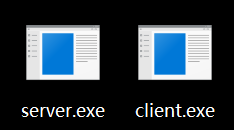

在控制台输入可执行文件的文件名及其后缀，就可以运行这个程序。

### 运行指南

首先运行server.exe，程序会让你输入昵称。

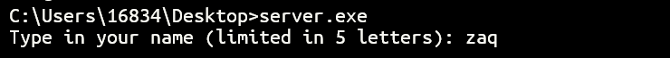

然后重新打开一个控制台终端，运行client.exe，输入昵称。换行确认之后，客户端将会连接服务端，控制台随后输出，引导客户端发送消息。

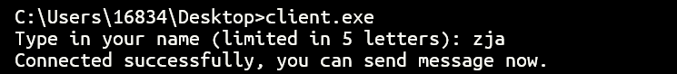

当轮到某一方发送消息的时候，在光标之前会出现一个`>`符号来提示他是输入方。

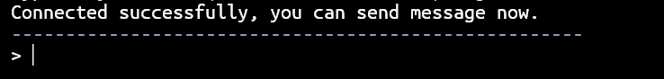

输入消息并空格输入结束符`*`，回车表示发送，在这条消息的下面将打印出发送方的昵称和他发送第一条消息的时间戳。

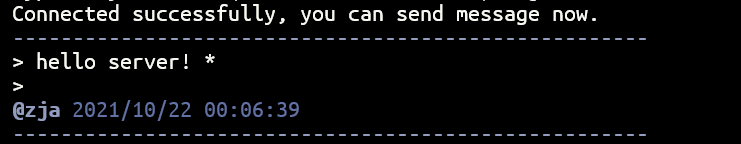

于此同时，接收方控制台也会出现这条消息，带昵称和时间戳。

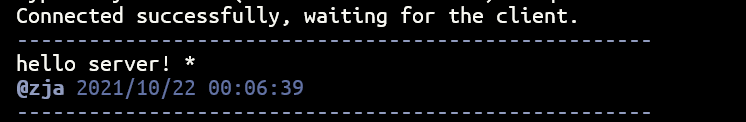

现在服务端是输入方，同样的流程可以向客户端发送消息。

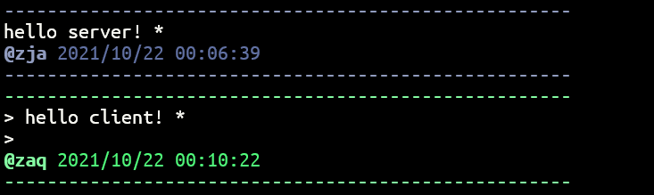

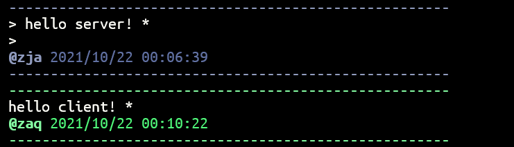

双方都可以通过发送`#`来结束对话。结束对话之后，客户端连接会被强行关闭，而服务端会等待下一个客户端。（左侧是服务端，右侧是服务端。）

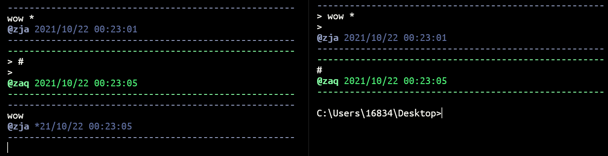

## 源码解释

### server.cpp

#### 打开服务等待客户端连接

```c
WSADATA wsaData;
WSAStartup(MAKEWORD(2, 2), &wsaData);
SOCKET sockSrv = socket(AF_INET, SOCK_STREAM, 0);

struct sockaddr_in server_addr;
memset(&server_addr, 0, sizeof(server_addr));  //每字节用0填充
server_addr.sin_family = AF_INET;  //使用IPv4地址
server_addr.sin_port = htons(1234);  //端口
server_addr.sin_addr.s_addr = inet_addr("127.0.0.1");  //IP

bind(sockSrv, (SOCKADDR*)&server_addr, sizeof(SOCKADDR));
listen(sockSrv, 1);
```

#### 连接客户端

```c
SOCKADDR clntAddr;
int nSize = sizeof(SOCKADDR);
SOCKET sockConn = accept(sockSrv, (SOCKADDR*)&clntAddr, &nSize);
```

#### 发送自己昵称获取对方昵称

```c
if(firstSend){
    send(sockConn, sname, 5, 0);
    recv(sockConn, cname, 5, 0);	//经过测试成功获得了对方的id
    firstSend=false;
}
```

#### 接收对方的消息

其中`isExit`记录是否在下次循环结束。

```c
do {
    recv(sockConn, recvBuf, BUFSIZE, 0);
    if(firstToken){
        strcpy(timestamp,recvBuf);//以备后续输出
        cout<<recvBuf+14<<' ';
        firstToken=false;
    }
    else{
        cout<<recvBuf<<' ';
    }
    if (*(recvBuf+14) == '#') {
        *recvBuf = '*';
        isExit = true;
    }
} while (*recvBuf != '*');
```

#### 发送自己方的消息

```c
do {
    if(newLine){
        cout<<"> ";
        newLine=false;
    }
    //不需要每次都发送时间戳，只在这一次开始就可以了
    if(firstToken){
        cin>>sendBuf+14;
        firstToken=false;
    }
    else{
        cin>>sendBuf;
    }
    send(sockConn, sendBuf, BUFSIZE, 0);
    if (*(sendBuf+14) == '#') {
        send(sockConn, sendBuf, BUFSIZE, 0);
        *sendBuf = '*';
        isExit = true;
    }
} while (*sendBuf != '*');
```

#### 输出时间戳和昵称

```c
cout <<"\n"<< "\033[34m\033[1m";
cout<<"@"<<cname;
cout << "\033[0m" ;
timePrint(timestamp,1);
cout<<"\033[34m\033[1m-----------------------------------------------------\033[0m";
```

#### 关闭连接

```c
closesocket(sockConn);
closesocket(sockSrv);
```

### client.cpp

#### 和服务器建立连接

```c
WSADATA wsaData;
WSAStartup(MAKEWORD(2, 2), &wsaData);
SOCKET sockClient = socket(AF_INET, SOCK_STREAM, 0);

struct sockaddr_in server_addr;
memset(&server_addr, 0, sizeof(server_addr));  //每字节用0填充
server_addr.sin_family = AF_INET;
server_addr.sin_port = htons(1234);
server_addr.sin_addr.s_addr = inet_addr("127.0.0.1");  //IP

connect(sockClient, (SOCKADDR*)&server_addr, sizeof(SOCKADDR));
```

### timeStamp.h

```c
#ifndef TIMESTAMP_H
#define TIMESTAMP_H
void getTime(char*);
void timePrint(char*,int color);
#endif
```

### timeStamp.cpp

实现头文件中定义的文件

```c
//简单粗暴地将原本纯数字的字符串转化为 2021/10/21 22:03:21 形式
//由于涉及到的位数不多，连循环都没有用，就是每一位处理。
//把处理好的字符串放入传入的字符指针中。
void getTime(char* res);

//把原本纯数字的字符串输出到控制台。因为是双方聊天，颜色有两种，绿色和蓝色
//color=0, green
//color=1, blue
void timePrint(char*time,int color);
```

## 可以改进的方向

### 聊天的限制

双方**只能在各自的回合发送信息**，而不能随时输入和接收。虽然在一方输入换行符号之后，另一方可以实时看到内容，却不能对此做出应答。

而且由于在设计的时候，它就是一个双人聊天的程序，所以一个服务器无法同时服务多个客户端。

### 对中断的处理不成功

没有添加客户端或者服务器进入或退出、连接或断开的提示。

尤其是**没有很好地处理键盘ctrl+c中断**，如果一方在它输出的回合通过键盘终止了程序，那么另外一方则会由于时间戳不带结束符而不断输出时间戳。对于这个问题，我还没有找到解决的办法。（如果一方不是在它输出的回合通过键盘终止程序，那么没有问题，可以正常退出。）

### 标识正在输入的字符问题

如前文所示，只能够实现在输入区的第一行和最后一行显示这个字符。我原本的设计是每一行都有一个`>`，像python命令行一样。

但是如果在每个循环都写`>`，那么上一行中有几个分隔段（以空格分隔），就会输出几个`>`，由于解决不了这个bug，我干脆不写每行都有`>`了。

### 一个奇特的问题

我使用的控制台不是原生的控制台，是fluent terminal，它支持ANSI转义序列，所以我可以通过在cout时在输出内容的开头和结尾添加转义字符串，改变这两个字符串之间输出内容的颜色。但是由于这个应用不支持中文，所以无法输出中文字符。

一个正常的fluent terminal输出界面：

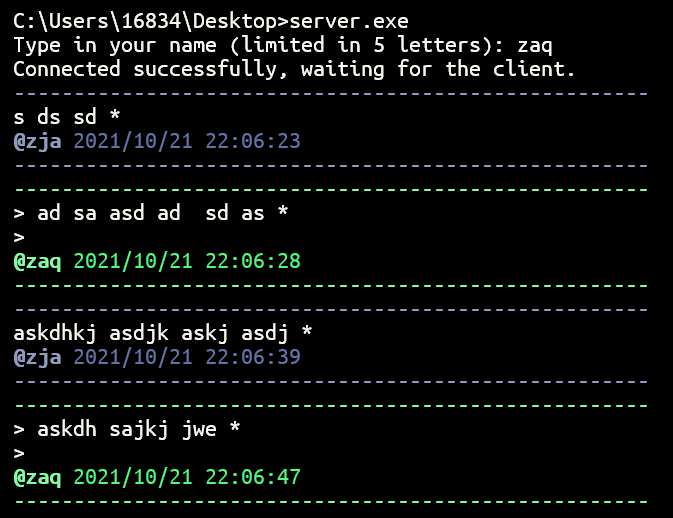

我在windows10原生的控制台上也测试了这个程序，发现可以输出中文序列，这说明无法输出中文序列并不是程序的问题。由于原生控制台不支持ANSI转移序列，所以在在转义字符串的位置会输出乱码，而且也无法改变颜色。

可以输出中文的原声控制台：

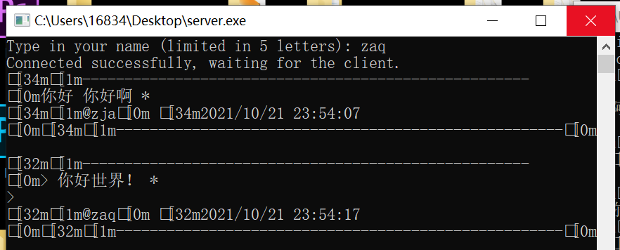

我试图通过更改系统的设置使原生控制台也支持ANSI转移序列，但由于可能使系统崩溃，所以放弃了。

综上所述我将使用非原生控制台来展示程序。
